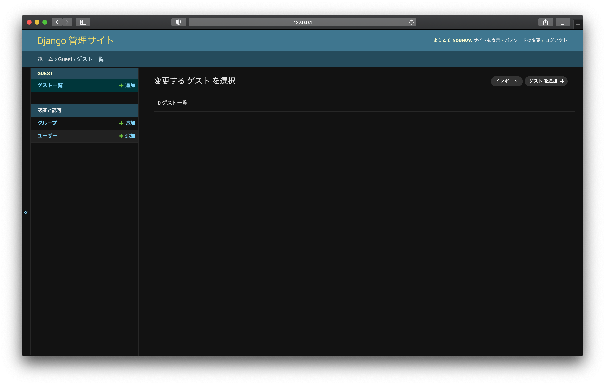
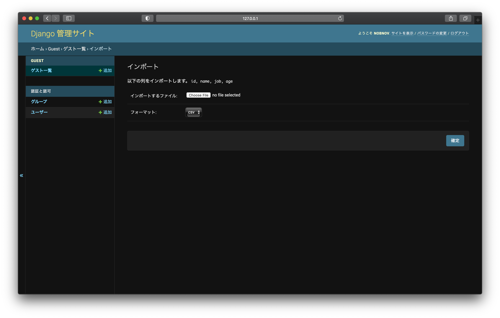
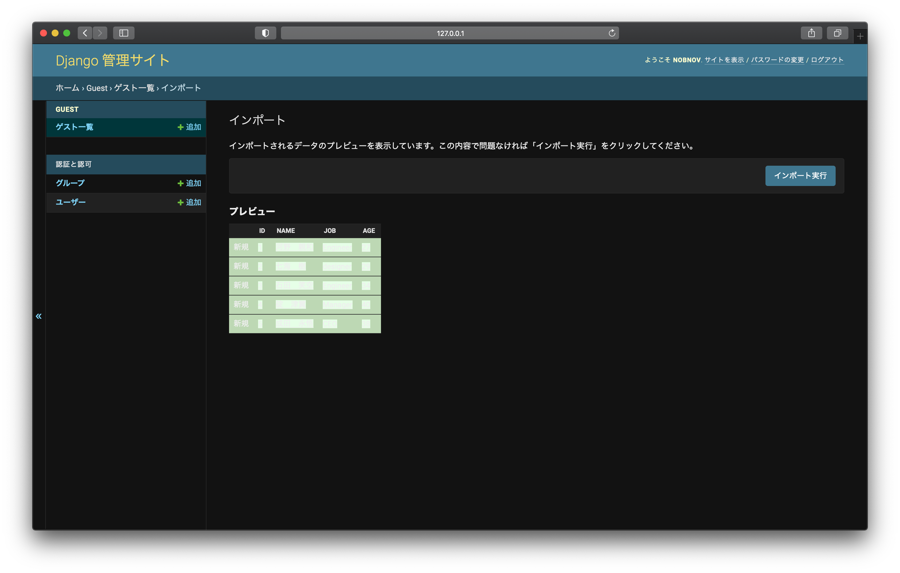
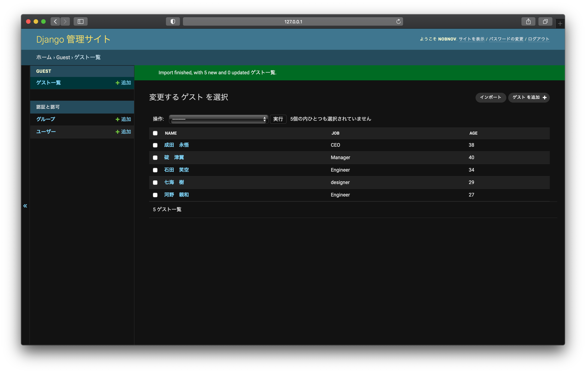

# Django-import-CSV

import CSV file at Django admin site

## Usage

	$ pip install -r requirements.txt
(Clone from repository)
	
or

	$ pip install Django django-import-export
(Manually install)
	
## Sample usage

import file

select file

preview data

## Result

## Author
**nobnov (Nobukazu Ishii / Fantom, Inc. CEO)**

- [Twitter](https://twitter.com/nobnov)
- [Facebook](https://www.facebook.com/nobnov.ISHII)